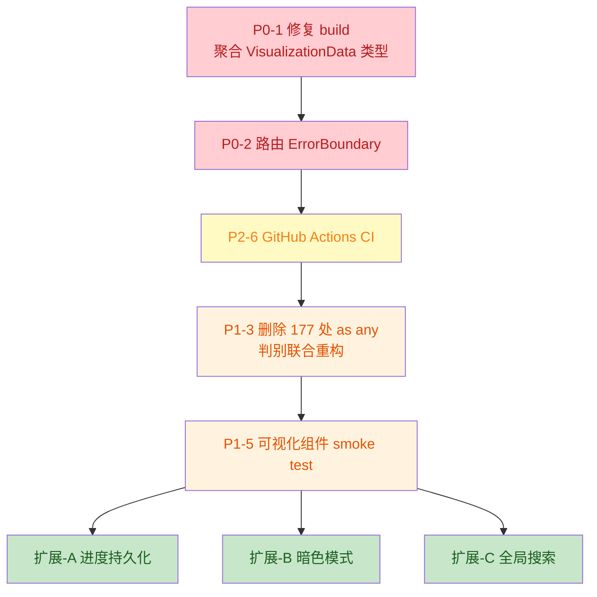

以下是基于项目实际数据的系统性复盘分析报告，已整理为 Markdown 格式：

---

# 📊 前端学习之旅项目 · 系统性复盘分析报告

> **分析时间**：2026-06-28  
> **项目规模**：93,375 行 TS/TSX · 284 文件 · 25 模块 · 200+ 可视化组件  
> **技术栈**：React 19.2 + Vite 8 + Tailwind 3.4 + TypeScript 6

## 一、项目快照

| 维度         | 数据                      | 说明                                |
| :----------- | :------------------------ | :---------------------------------- |
| **代码规模** | 93,375 行 / 284 文件      | 单仓库结构，无 monorepo             |
| **内容覆盖** | 25 个学习模块             | HTML → 算法 → 全栈完整体系          |
| **交互组件** | 200+ 个                   | 分布在 30+ 子领域目录               |
| **测试状况** | 306 用例 / 27 文件 (全绿) | 以数据形状/计数断言为主             |
| **Git 历史** | 8 次提交 / 单人开发       | 时间戳式提交，无 CI/PR/Review       |
| **知识沉淀** | 4 天会话 / 3 条教训       | 已记录浅拷贝、变量声明、parser 问题 |

---

## 二、改进之处（按严重度排序）

### 🔴 P0：阻断性问题

#### 1. `npm run build` 失败，质量门禁失真

- **证据**：`tsc --noEmit` 通过，但 `tsc -b` 报 **78 个 TS 错误**。根因是 `tsconfig.app.json` 配置不一致及 `VisualizationData` 联合类型未包含扩展模块子类型。
- **影响**：项目无法构建发布；CI 若只跑 `noEmit` 会误判；新组件持续累积类型错误。
- **建议**：
  1.  聚合各 `*-visualization-types.ts` 到 `VisualizationData` 联合类型。
  2.  质量门禁升级为 `npm run build`。
  3.  增加 `precommit: tsc -b --noEmit` 钩子。
- **资源**：约 2-3h 集中重构。

#### 2. 路由层缺少 ErrorBoundary，用户遭遇白屏

- **证据**：用户已两次遇到 "Unexpected Application Error!"（浅拷贝 bug、未声明变量）。`router.tsx` 和 `Layout.tsx` 均无错误边界。
- **影响**：单组件运行时错误导致整个模块页白屏，无法降级。
- **建议**：
  1.  根路由加 `errorElement: <RootErrorBoundary />`。
  2.  `VisualizationRenderer` 外层包裹局部 ErrorBoundary，错误时显示占位符。
- **资源**：约 30 min。

### 🟠 P1：架构性技术债

#### 3. `VisualizationRenderer` 存在 177 处 `data as any`

- **证据**：每个 case 分支都强转类型，模块数据与组件 props 契约完全无校验。这是 P0 #1 和运行时崩溃的共同根因。
- **建议**：用**判别联合（Discriminated Union）** 重构 `VisualizationBlock`，通过 `switch(type)` 自动收窄类型，彻底删除 `as any`。
- **资源**：半天（可分模块渐进迁移）。

#### 4. 零代码分割，200+ 组件全量同步导入

- **证据**：`VisualizationRenderer` 顶部同步导入所有组件，无 `React.lazy`。首屏 JS 粗估 >2MB。
- **建议**：按子域分包，使用 `React.lazy` + `Suspense` 按需加载；路由级组件也改为 lazy。
- **资源**：2-3 天（含骨架屏 + 路由分割）。

#### 5. 测试只验"数据形状"，不验"组件行为"

- **证据**：306 测试全绿，但无任何测试实际渲染组件并断言不抛错。用户撞到的崩溃 bug 测试均未覆盖。
- **建议**：为每个可视化组件加 **Smoke Test**（默认 data 渲染 + 切换 step + 模拟点击），断言不抛错。
- **资源**：每组件 10-15 min，优先覆盖算法类。

### 🟡 P2：流程与工程规范

#### 6. 无 CI / 无提交门禁 / 非语义化提交

- **现状**：时间戳式提交，无 GitHub Actions，无 husky/commitlint。
- **建议**：配置 CI 流水线（build + test）；接入 conventional commit + lint-staged。
- **资源**：1-2 h。

#### 7. `interview-prep.ts` 含 125 处 `console.*`

- **现状**：全项目 294 处 console，该文件占近半数，混杂教学示例与调试日志。
- **建议**：区分教学代码与调试日志；模块数据层加 ESLint `no-console` 规则。
- **资源**：1 h。

#### 8. 项目知识沉淀机制不完整

- **现状**：Memory 仅记录 bug 修复教训，缺乏前置设计约束文档。
- **建议**：在 `project_memory.md` 新增 "Design Constraints"，明确类型注册、深拷贝、smoke test 等强制规范。

---

## 三、可拓展之处（按价值/成本比排序）

### 🟢 高价值低成本

- **A. 学习进度持久化**：用 `zustand/persist` + SM-2 间隔重复算法，从"参考文档"升级为"学习工具"。（2-3 天）
- **B. 暗色模式**：Tailwind 已有语义化颜色基础，补 `dark:` 变体 + 切换器即可。（1 天）
- **C. 全局搜索**：用 `flexsearch/minisearch` + Cmd+K 命令面板，解决"找不到"痛点。（1-2 天）

### 🟡 中价值中成本

- **D. 分享即代码**：组件状态序列化到 URL query，支持教学场景协作。（每组件 30 min）
- **E. 性能监控**：落地 manualChunks + Web Vitals 上报，让项目自身成为最佳实践示范。（2 天）
- **F. 内容编辑器**：内容抽离为 YAML/CMS，降低贡献门槛。（3-5 天）

### 🔵 长期方向

- **G. 多端适配**：响应式断点 + 触摸手势优化。
- **H. 国际化**：i18n key 抽取，支持英文版。
- **I. AI 助教**：接入 LLM，基于 KP 上下文回答追问。

---

## 四、优先级行动清单

**推荐执行顺序**：

1.  **止血**：P0-1（修复构建）→ P0-2（ErrorBoundary）
2.  **立规矩**：P2-6（CI 先立起来）
3.  **防复发**：P1-3（类型重构）→ P1-5（Smoke Test）
4.  **提价值**：扩展项 A/B/C 按需选择

---

## 五、核心反思

1.  **测试数量 ≠ 质量**：306 测试全绿却挡不住运行时崩溃。测试覆盖了"数据对不对"，没覆盖"组件跑不跑得起来"，这是最大盲区。
2.  **类型系统在边界处断裂**：`VisualizationRenderer` 的 `as any` 黑洞是构建失败和运行时崩溃的共同根因，必须用判别联合修复。
3.  **单人开发缺反馈环**：无 CI、无 Review、无预发构建，问题只能靠用户撞出来。Memory 记录的 3 条教训全是运行时崩溃，印证了反馈环缺失。
4.  **教学项目的"反讽"风险**：项目教了 Web Vitals/ErrorBoundary/Lazy Loading，自身却未落地。若被学员当作参考实现会传递错误信号。**项目自身必须成为最佳实践示范。**
